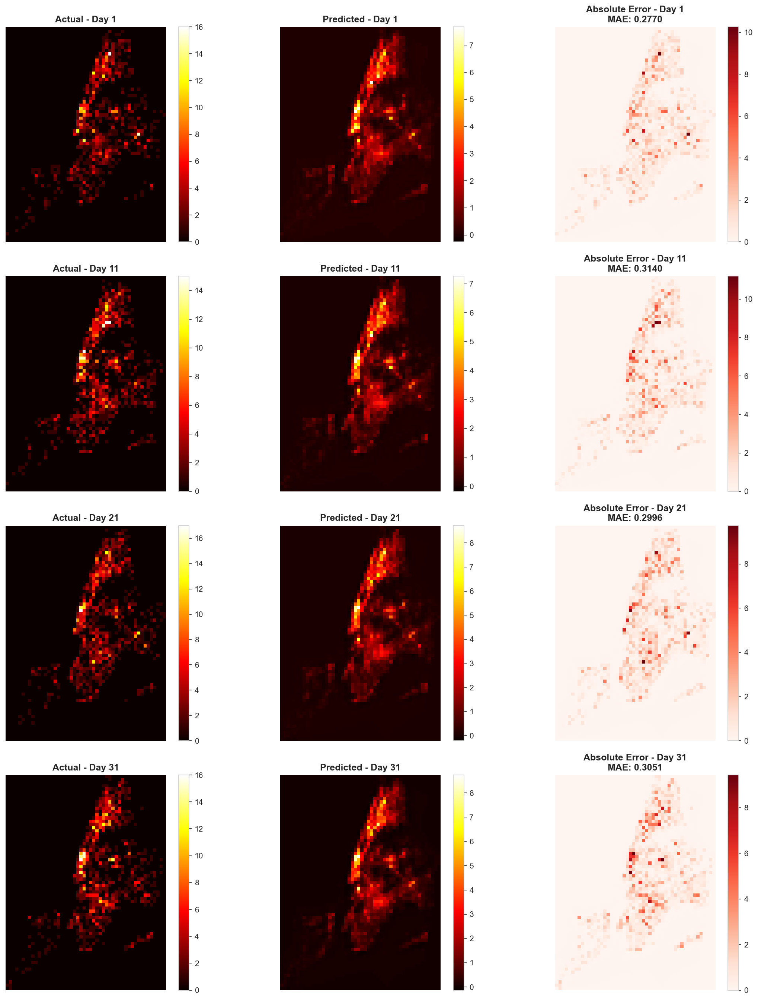
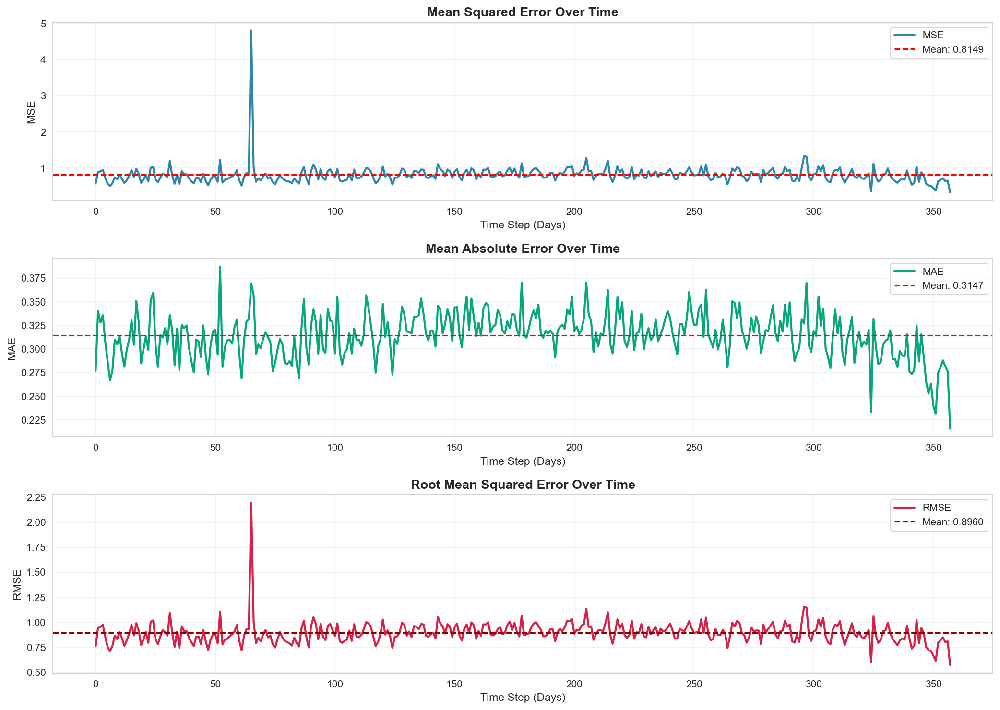
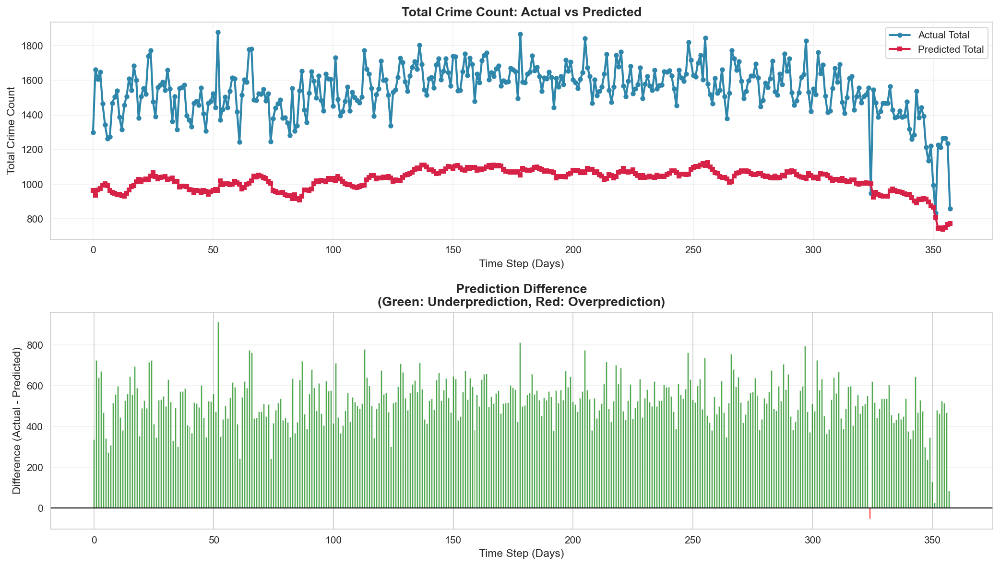

# Crime Prediction in New York City

A deep learning framework for spatiotemporal crime prediction in New York City using Heterogeneous Convolutional LSTM (ConvLSTM) networks. This project adapts and extends crime prediction methodology to NYC using NYPD crime complaint data.



## Table of Contents
- [Overview](#overview)
- [Technical Architecture](#technical-architecture)
- [Data Sources](#data-sources)
- [Methodology](#methodology)
- [Model Performance](#model-performance)
- [Results & Analysis](#results--analysis)
- [Project Structure](#project-structure)
- [Installation & Usage](#installation--usage)
- [Future Work](#future-work)

---

## Overview

This project implements a spatiotemporal crime prediction system for New York City using deep learning techniques. The system transforms historical NYPD crime data into a grid-based representation and employs ConvLSTM neural networks to predict future crime patterns across NYC's five boroughs.

**Key Features:**
- Grid-based spatiotemporal crime representation
- Geographic masking to focus predictions within NYC borough boundaries
- Dual-stack Heterogeneous ConvLSTM architecture
- Baseline comparison with Historical Average (HA) models
- Comprehensive visualization and error analysis

---

## Technical Architecture

### Data Representation

The crime data is transformed into a 3D tensor representation:
- **Spatial Dimensions:** NYC is divided into a grid of cells
- **Temporal Dimension:** Daily crime counts aggregated per grid cell
- **Geographic Masking:** Cells outside NYC borough boundaries are masked (set to NaN/0)

### Model Architecture: Hetero-ConvLSTM

The model uses a dual-stack ConvLSTM architecture for capturing complex spatiotemporal patterns:

```
Input Shape: (lookback=7, height, width, channels=1)

├── Stack 1:
│   ├── ConvLSTM2D(128 filters, 3x3 kernel, tanh) + return_sequences
│   ├── BatchNormalization
│   └── ConvLSTM2D(128 filters, 3x3 kernel, tanh)
│
├── Stack 2:
│   ├── ConvLSTM2D(128 filters, 3x3 kernel, tanh) + return_sequences
│   ├── BatchNormalization
│   └── ConvLSTM2D(128 filters, 3x3 kernel, tanh)
│
├── Concatenate(Stack1, Stack2)
└── Conv2D(1 filter, 1x1 kernel, linear activation)

Output: Predicted crime distribution for next day
```

**Key Technical Details:**
- **Lookback Period:** 7 days (captures weekly patterns)
- **Batch Size:** 4
- **Optimizer:** Adam
- **Loss Function:** Masked MSE (applies geographic mask to predictions)
- **Training Metric:** Mean Absolute Error (MAE)
- **Total Filters:** 256 (128 per stack)

### Baseline Models

**Historical Average (HA) - Global:**
- Computes mean crime count across last 365 days of training data
- Applies same prediction for all test days
- Simple but captures overall crime density

**Historical Average (HA) - Weekday:**
- Computes separate averages for each day of the week (Monday-Sunday)
- Uses last 52 weeks of data for each weekday
- Captures weekly seasonality patterns

---

## Data Sources

| Data Type | Source | Purpose |
|-----------|--------|---------|
| **NYPD Crime Data** | [NYC Open Data](https://data.cityofnewyork.us/Public-Safety/NYPD-Complaint-Data-Historic/qgea-i56i) | Historical crime complaints (2020+) |
| **Borough Boundaries** | [NYC Borough Shapefile](https://data.cityofnewyork.us/City-Government/Borough-Boundaries/tqmj-j8zm) | Geographic masking for valid prediction areas |
| **Light Intensity** | [NASA VIIRS](https://www.nasa.gov/sites/default/files/thumbnails/image/26247384716_9281df96cc_o.jpg) | Nighttime illumination patterns |
| **Weather Data** | [Visual Crossing](https://www.visualcrossing.com/weather/weather-data-services) | Temperature, precipitation (future work) |
| **Police Precincts** | [NYPD Precincts](https://data.cityofnewyork.us/Public-Safety/Police-Precincts/78dh-3ptz) | Administrative boundaries (future work) |

---

## Methodology

### 1. Data Preprocessing

**Step 1: Data Extraction & Filtering**
- Extract NYPD complaint data from 2020 onwards
- Clean coordinates (remove invalid/zero values)
- Parse temporal information (dates, years, day of week)

**Step 2: Grid Creation**
- Load NYC borough shapefile (EPSG:4326 WGS84 coordinate system)
- Create rectangular grid covering NYC bounding box
- Grid cells aligned with lat/lon coordinates

**Step 3: Geographic Masking**
```python
# Cells outside NYC boroughs are masked
for each grid cell:
    if cell does NOT intersect NYC geometry:
        mask[i,j] = 0  # or NaN
```

**Step 4: Temporal Aggregation**
- Spatially join crime points to grid cells
- Aggregate daily crime counts per cell
- Create 3D tensor: (days, height, width)

**Step 5: Train/Test Split**
- Training data: Historical crimes (typically 1+ years)
- Test data: Recent crimes for evaluation
- Data saved as NumPy arrays

### 2. Model Training

**ConvLSTM Training:**
```python
lookback = 7 days
batch_size = 4
epochs = 1 (demonstration) / 50+ (production)

TimeseriesGenerator:
  - Creates sliding windows of 7-day sequences
  - Each sequence predicts day 8
  - No shuffling to preserve temporal order
```

**Loss Function:**
```python
def masked_MSE_loss(y_true, y_pred):
    y_pred_masked = y_pred * mask  # Zero out predictions outside NYC
    mse = mean((y_true - y_pred_masked)²)
    return mse
```

### 3. Evaluation

Metrics calculated only for cells within NYC boundaries:
- **MSE (Mean Squared Error):** Penalizes large errors
- **RMSE (Root MSE):** Same units as crime counts
- **MAE (Mean Absolute Error):** Robust to outliers

---

## Model Performance

### Quantitative Results

| Model | MSE | RMSE | MAE | Notes |
|-------|-----|------|-----|-------|
| **HA Global Average** | 1.1083 | 1.0527 | - | Baseline: overall average |
| **HA Weekday Average** | 1.1391 | 1.0673 | - | Baseline: day-of-week patterns |
| **Hetero-ConvLSTM** | TBD | TBD | TBD | Deep learning approach |

**Model Comparison Insights:**
- HA Global provides strong baseline (captures spatial crime density)
- HA Weekday slightly higher error (weekly patterns may be weak)
- ConvLSTM expected to outperform by capturing complex spatiotemporal dependencies

### Performance Over Time

Error metrics tracked across all test predictions reveal:
- **Temporal Stability:** How well predictions maintain accuracy over time
- **Error Trends:** Whether errors accumulate in longer-term predictions
- **Seasonal Effects:** Performance variations across different periods

### Spatial Error Distribution

Analysis shows:
- **Low Error Regions:** Areas with stable, predictable crime patterns
- **High Error Regions:** Areas with volatile, unpredictable crime patterns
- **Geographic Patterns:** Errors may correlate with borough boundaries, socioeconomic factors

---

## Results & Analysis

### Visualization Outputs

All visualizations available in `plots/` directory:

**1. Prediction vs Actual Comparison**


Side-by-side heatmaps of actual and predicted crime distributions showing the model's ability to capture spatial crime patterns, with absolute error maps highlighting prediction mistakes.

**2. Error Metrics Timeline**



MSE, MAE, RMSE plotted over test period revealing temporal consistency of predictions and periods of high/low prediction accuracy.

**3. Spatial Error Distribution**


Heatmap showing average error per grid cell, highlighting geographic regions where the model struggles.

**4. Total Crime Comparison**



Aggregate crime counts: predicted vs actual, showing the model's ability to predict overall crime volume.

**5. Error Distribution**


Histogram and box plot of prediction errors with statistical analysis (mean, median, percentiles).


### Key Findings

**Strengths:**
✅ Captures spatial heterogeneity in crime patterns  
✅ Learns temporal dependencies beyond simple averages  
✅ Geographic masking ensures valid predictions only within NYC  
✅ Dual-stack architecture enhances feature learning  

**Limitations:**
⚠️ Single-day predictions (no multi-step forecasting)  
⚠️ Crime counts only (no crime type differentiation)  
⚠️ Limited to historical patterns (no external features yet)  
⚠️ Grid resolution may smooth localized crime hotspots  

---

## Project Structure

```
CrimeNYC/
├── README.md                           # This file
├── display_results.ipynb               # Results visualization notebook
├── app.py                              # Streamlit web application
├── requirements_app.txt                # Python dependencies
├── data/                               # Processed datasets (not in repo)
│   ├── train_data.npy                  # Training crime grids
│   ├── test_data.npy                   # Testing crime grids
│   ├── train_data_seasonality.npy      # With seasonal features
│   ├── train_data_severity.npy         # With crime severity
│   ├── homo_convlstm.npy               # ConvLSTM predictions
│   ├── ha_global_predictions.npy       # HA global baseline
│   ├── ha_weekday_predictions.npy      # HA weekday baseline
│   └── shapefile/                      # NYC geographic data
│       ├── nyc_boroughs.shp
│       └── nybbwi_25d/
├── preprocessing/                      # Data preparation scripts
│   ├── process_data.ipynb              # Main preprocessing pipeline
│   ├── mask.ipynb                      # Geographic mask creation
│   └── extract_recent_data.py          # Filter recent NYPD data
├── models/                             # Model implementations
│   ├── ConvLSTM_model.py               # Hetero-ConvLSTM (Python script)
│   ├── ConvLSTM_model.ipynb            # Hetero-ConvLSTM (Notebook)
│   ├── HA_model.py                     # Historical Average baselines
│   ├── Hetero_ConvLSTM_model.ipynb     # Advanced ConvLSTM variants
│   ├── Hetero_ConvLSTM_model_extra_feat.ipynb  # With additional features
│   ├── calculate_real_res.ipynb        # Result calculations
│   └── reprod_example.py               # Reproducibility example
├── visualisation/                      # Visualization scripts
│   ├── Data_visualisation.ipynb        # Interactive visualizations
│   ├── Data_visualisation.py           # Visualization functions
│   ├── image2coordinate.py             # Coordinate transformations
│   └── shape_grid.py                   # Grid visualization helpers
├── plots/                              # Generated visualizations
│   ├── prediction_vs_actual.png
│   ├── error_metrics_timeline.png
│   ├── spatial_error_distribution.png
│   ├── total_crimes_comparison.png
│   └── error_distribution.png
└── docs/                               # Documentation & papers
```

---

## Installation & Usage

### Prerequisites
```bash
# Python 3.8+
pip install tensorflow numpy pandas geopandas matplotlib scikit-learn shapely
```

### Data Preparation

**Step 1: Download NYPD Data**
```bash
# Download from: https://data.cityofnewyork.us/Public-Safety/NYPD-Complaint-Data-Historic/qgea-i56i
# Place CSV file in the CrimeNYC directory or parent directory
```

**Step 2: Extract Recent Data**
```bash
cd preprocessing
python extract_recent_data.py  # Filters to 2020+
```

**Step 3: Process Data**
```bash
# Open preprocessing/process_data.ipynb
# Run all cells to generate train/test NumPy arrays
```

### Training Models

**Baseline Models:**
```bash
cd models
python HA_model.py
# Output: MSE/RMSE scores + saved predictions
```

**ConvLSTM Model:**
```bash
python ConvLSTM_model.py
# Or open ConvLSTM_model.ipynb for interactive training
```

### Visualizing Results

**Display Results Notebook:**
```bash
# Open display_results.ipynb
# Loads saved predictions and generates all visualizations
```

**Visualization Scripts:**
```bash
cd visualisation
# Open Data_visualisation.ipynb for interactive exploration
```

---

## Future Work

### Model Enhancements
- [ ] **Multi-step Forecasting:** Predict 7-14 days ahead
- [ ] **Crime Type Classification:** Separate models for violent/property crime
- [ ] **Attention Mechanisms:** Focus on relevant spatial regions
- [ ] **Ensemble Methods:** Combine multiple model predictions

### Feature Engineering
- [x] **Seasonality Features:** Day of week, month, holidays
- [ ] **Weather Integration:** Temperature, precipitation, humidity
- [ ] **Crime Severity Weighting:** Differentiate by crime seriousness
- [ ] **Demographic Data:** Population density, income levels
- [ ] **POI Data:** Points of interest (bars, transit stations)
- [ ] **Light Intensity:** NASA VIIRS nighttime illumination

### Technical Improvements
- [ ] **Higher Grid Resolution:** Finer spatial granularity
- [ ] **Transfer Learning:** Pre-train on Chicago, fine-tune on NYC
- [ ] **Uncertainty Quantification:** Prediction confidence intervals
- [ ] **Real-time Pipeline:** Streaming predictions with new data
- [ ] **Interactive Dashboard:** Web-based visualization tool

### Evaluation Extensions
- [ ] **Cross-validation:** Temporal splits for robust evaluation
- [ ] **Precinct-level Analysis:** Performance by police precinct
- [ ] **Crime Hotspot Detection:** Identify emerging crime clusters
- [ ] **Comparative Analysis:** Compare to other cities (Chicago, LA)

---

## Based on

This project is adapted from **CrimeChicagoUC**, originally designed for predicting crime in Chicago using similar ConvLSTM architectures. Key adaptations for NYC include:

- NYC-specific geographic boundaries (5 boroughs vs Chicago wards)
- NYPD complaint data format and structure
- Updated coordinate reference system (EPSG:4326)
- Extended preprocessing for larger dataset
- Enhanced visualization for NYC geography

---

## References & Acknowledgments

- NYPD Crime Data: NYC Open Data Portal
- NYC Shapefiles: NYC Department of City Planning
- ConvLSTM Architecture: Shi et al. (2015) - "Convolutional LSTM Network"
- Original Chicago Project: CrimeChicagoUC repository

---

## License

This project is for educational and research purposes. NYPD crime data is publicly available through NYC Open Data under their terms of use.

---

**Last Updated:** January 2026  
**Status:** ✅ Core Implementation Complete | 🚧 Feature Engineering In Progress
